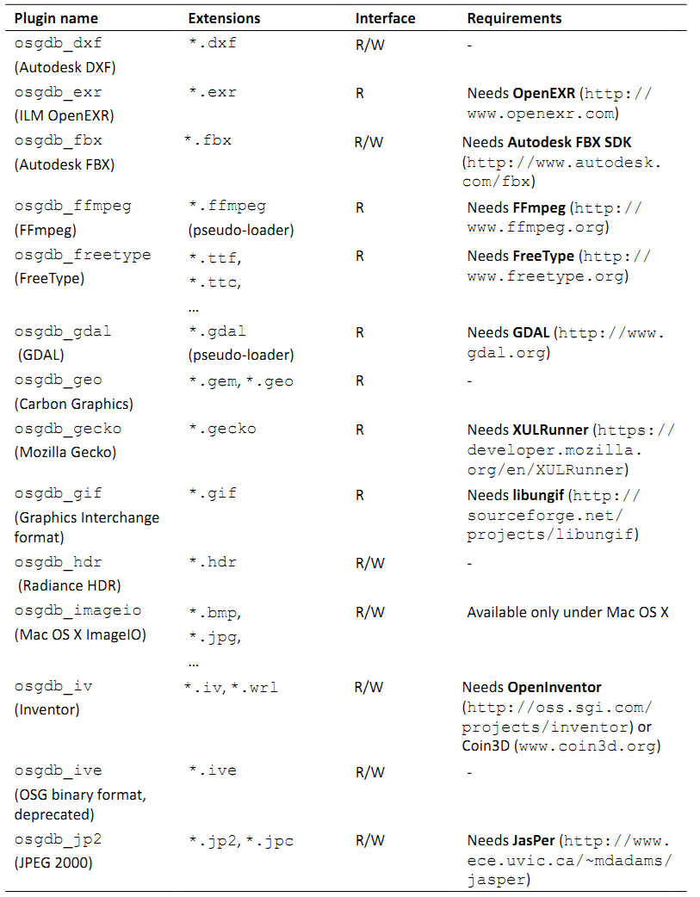
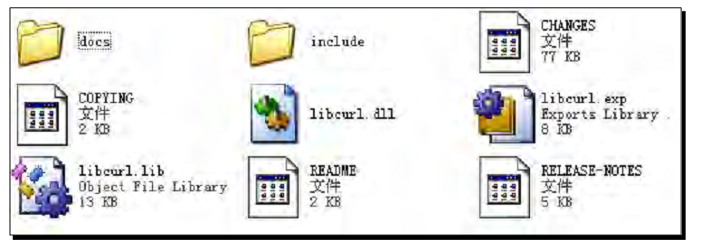
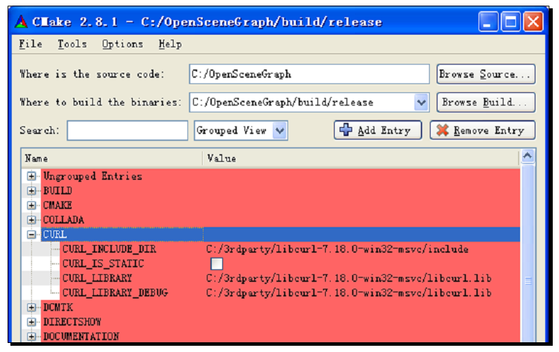
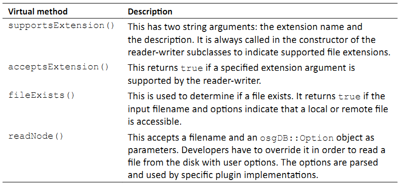

Chapter 10: Saving and Loading Files
======================================

编程中一个更为重要的概念就是在程序结束之后存储信息的能力。这有许多优点，例如较小的可执行大小，容易实现模块化，以及程序记住不同用户信息的能力。

osgDB库提供对读取与写入场景图模型，图像以及其他对象的支持。他同时实现了一个插件框架以及文件I/O实用程序类。他允许各种文件模式，包括将整个场景图元素封装为文本或是二进制文件，可以按需动态载入的OSG原生格式。

在本章中，我们将会讨论：

* OSG中所实现的文件I/O机制
* 当前所支持的文件格式的完整列表，包括模型，图像，字体等
* OSG伪载入的概念与使用
* 如何自定义OSG插件接口并为用户定义的格式提供支持
* 如何创建类包装器为OSG原生格式的序列I/O提供支持

Understanding file I/O plugins
--------------------------------

在第2章中我们已经了解一些读取与写入数据文件的插件机制。借助于特定的格式管理插件，OSG可以由处部文件载入各种模型，图像，字体甚至视频数据。这里的插件独立于自定义基于OSG程序的支持文件格式的功能组件。他被看作是实现必需读取或写入接口（或同时两者）的共享库文件。用户需要不同的插件来载入并构建大而复杂的场景图而不需要更多的编程工作。

所有的文件I/O插件遵循相同的命名约定；否则他们不会被识别并且不能用于读取文件。以原生的.osg文件格式作为示例：在Windows系统下，插件库文件是osgdb_osg.dll。在Linux下名字则为osgdb_osg.so。两者都具有osgdb_前缀，而其后的名字通常表示文件扩展名。

然而，一个插件有可能支持多个扩展名。例如，JPEG图像格式使用.jpeg与.jpg作为最常见的文件扩展名。在两者之间并没有本质的区别，所以统一的osgdb_jpeg插件应该足够处理任意扩展名的输入与输出。幸运的是，osgDB库可以通过一个内部的扩展到处理器映射来支持这种插件类型，我们将会在后面进行介绍。

在文件I/O插件准备好并且放置在可以被引用的位置之后，我们可以使用osgDB名字空间的函数来读取OSG场景节点或是图像：

::

    osg::Node* node = osgDB::readNodeFile( "cow.osg" );
    osg::Image* image = osgDB::readImageFile( "Images/lz.rgb" );
    
正如我们刚才所讨论的，OSG将会自动查找名为osgdb_osg与osgdb_rgb的插件库文件并由磁盘读取这两个文件。所需的数据文件应位于特定的相对或是绝对路径，或是由环境变量OSG_FILE_PATH所定义的OSG查找路径中。

Discovery of specified extension
-----------------------------------

查找与定位用于特定文件类型处理的基本原则可以使用以下两步来描述：

首先，OSG在osgDB::Registry类管理一个常用的插件列表。这个类被设计为单例模式，并且只能使用instance()方法进行实例化与获取。osgDB注册的保护插件列表有助于基于责任链设计模式快速查找并调用所需格式的读或写实体。这意味着每一个插件对象，在OSG中称为读取器－写入器，将会尝试处理输入文件的扩展，如果扩展不为该插件所识别，则将其传递给列表中的下一个插件。

如果预存储的读取器－写入器均不能处理该文件扩展，OSG将会使用该扩展作为一个关键词来查找并由外部共享模块载入插件，也就是osgdb_<ext>库文件。这里，<ext>表示扩展字符串，但是扩展到处理器映射同时被用于确定扩展与特殊插件库名的关系。例如，我们可以使用addFileExtensionAlias()方法定义扩展字符串与插件名字的关系：

::

    // Add alias extensions for specified plugin
    osgDB::Registry::instance()->addFileExtensionAlias( "jpeg", "jpeg" );
    osgDB::Registry::instance()->addFileExtensionAlias( "jpg", "jpeg" );
    // Now OSG can read .jpg files with the osgdb_jpeg plugin
    osg::Image* image = osgDB::readImageFile( "picture.jpg" );
    
在任何其他的读取与写入操作之前调用这两行会自动将*.jpeg与*.jpg文件链接到osgdb_jpeg库文件，后者是在这种文件类型需要使用时自动载入的。

注意，我们并不需要为JPEG支持添加这样的别名，因为当注册对象被实例化时他已经被嵌入其中了。支持多文件格式的OSG预定义插件列在下节的表格中。

Supported file formats
------------------------

在这里我们列表OSG 3.0所支持的插件列表。其中的一些需要第三方依赖，我们在Notes列表中进行标识。Interface属性表明插件是否支持读（R）或写（W）接口。Extensions列的省略号表明插件支持其他的文件格式。我们可以在源码的src/osgPlugins目标中找到更为详细的信息。

.. image:: _images/osg_support_file_formats1.png

.. image:: _images/osg_support_file_formats3.png
.. image:: _images/osg_support_file_formats4.png
.. image:: _images/osg_support_file_formats5.png

为特定插件所列出的关于配置第三方依赖的细节可以在本章中的Configuring third-party dependencies一节中找到。另外，还有另一个名为Zlib的重要工程，被用作osgDB库与osgdb_ive插件的可选部分以允许OSG原生文件格式的压缩，并且也为某些第三方工程所需要。

The pseudo-loader
--------------------

在前面的表中，某些扩展被标记为伪载入器。这意味着他们并不是真正的文件扩展名，而只是向真正的文件名添加一个后缀以表明该文件应由特定的插件读取。例如：

::

    osgviewer worldmap.shp.ogr

磁盘上的真正文件为worldmap.shp，该文件将以ESRI的shapefile格式存储整个世界地图。后缀.ogr强制osgdb_ogr来读取.shp文件并构建场景图；否则将按默认设置自动查找并使用osgdb_shp。

另一个很好的示例就是osgdb_ffmpg插件。FFmpeg库支持超100种不同的编码。要读取任意一个，我们只是简单的文件名之后个后缀.ffmpeg，并将工作留给FFmpeg本身。

另外，我们已经看到一些其他如下面格式的伪载入器：

::

    node = osgDB::readNodeFile( "cessna.osg.0,0,90.rot" );

真正的文件名与后缀之间的字符串0,0,90是参数。某些伪载入器需要特定的参数来使其正常工作。

Time for action - reading files from the Internet
~~~~~~~~~~~~~~~~~~~~~~~~~~~~~~~~~~~~~~~~~~~~~~~~~~~~~~

要理解伪载入器的使用，我们将会尝试由网络载入一个模型。osgviewer实用程序对于执行该示例就足够了，但是我们也可以在基于OSG的程序中使用osgDB::readNodeFile()函数来实现相同的结果。

1. 模型已存在于下列URL处：http://www.openscenegraph.org/data/earth_bayarea/earth.ive

2. 在尝试由互联网或是内联网读取文件之前，我们最好检查一下OSG插件目录以确定是否存在osgdb_curl插件。如果我们使用第2章所描述的安装器进行安装，则应该存在该插件。但是对于由源代码编译OSG的开发者而言，在CMake配置中也许会被忽略。对于后一种情况，请参考下一节并首先获取该插件。

3. 使用下面的参数启动osgviewer程序：

::

    # osgviewer http://www.openscenegraph.org/data/earth_bayarea/earth.ive.curl
    
4. .curl后缀通知OSG使用osgdb_curl插件来载入特定的文件。多余的部分会自动被读取器-写入器接口移除。

5. 现在我们将会在屏幕上看到一个地球模型。使用我们的相机操作器旋转并缩放视图矩阵，并试着在地图上找到我们家的位置：

.. image:: _images/osg_earth.png

What just happened?
~~~~~~~~~~~~~~~~~~~~~~

尽管整个地球模型对于浏览来说比较粗略，我们依然会发现某些部分在我们缩放时会变得更为详细。实际上该模型是由一个;osg::PagedLOD节点树构成的，其中的每一个节点存储在远程站点上的一个单独文件中，并管理不同层级的地形几何体。该技术被称之为四边形树，我们会在本书的最后一章进行详细描述。

当由特定的URL分析并载入文件时，osgdb_curl插件会有极大的帮助。他依赖于一个名为libcurl的第三方库，该库提供了一个易于使用的客户端URL传播接口。在这里伪载入器机制可以快速确定所需要的文件名是否应被直接发送到osgdb_curl；否则OSG会首先检测文件名是否包含一个远程地址，并做出最终的决定。

Pop quiz - getting rid of pseudo-loaders
~~~~~~~~~~~~~~~~~~~~~~~~~~~~~~~~~~~~~~~~~~~

有些人也许会重命名伪载入器，例如，可以读取.avi，.mpg以及其他多种媒体格式的osgdb_ffmpeg库，或是类似osgdb_avi的其他插件名。然后，.ffmpeg后缀会变得不可用，并且只有.avi文件可以通过使用osgDB::readNodeFile()函数直接读取。现在，我们明白伪载入器失效的原因，以及如何使得新的osgdb_avi插件对于.mpg以及其他原始支持的格式依然可用吗？

Configuring third-party dependencies
---------------------------------------

我们是否使用过本地编译器与CMake系统由源码构建过OSG？那么当与安装器所提供的组件相比，我们就会发现在自制的OSG中有大量的未编译的组件。例如：

::

    # osgviewer --image picture.jpg

图像picture.jpg也许不会显示，尽管他位于正确的查找路径中。如果我们遇到这种情况，查看一下插件目录，我们就会发现没有osgdb_jpg或是osgdb_jpeg库。这是因为我们并没有为一个重要的第三方库libjpeg配置选项，该库是为JPEG读写器所需要的。

OSG本身并不会载入大多数的文件格式，而是将数据载入委托给第三方依赖。特别是当处理各种类型的模型，图像与文件时，有大量优秀的开源工程也可以为不同的插件用作第三方依赖。有效的方法可以在OSG引擎的与实现阶段为全世界的开发者所共享，并支持连续的，稳定的，团队风格的设计。

Time for action - adding libcurl support for OSG
~~~~~~~~~~~~~~~~~~~~~~~~~~~~~~~~~~~~~~~~~~~~~~~~~~

在本书中，我们将为由源码编译与链接OSG二进制构建osgdb_curl支持。如果没有必需的第三方库libcurl，osgdb_curl插件将会被整个解决方案所忽略，因而不会被生成。在第2章中，我们并没有介绍将libcurl添加到CMake配置的选项。但是借助于构建目录中保存的CMake缓存文件与中间文件，我们可以快速重启配置并重新构建我们的OSG库与开发文件。Visual Studio解决方案将会被自动更新来包含新的osgdb_curl工程。

1. 由下列网址下载预编译包：http://curl.haxx.se/download.html 。Visual Studio用户应在Win32-MSCV部分选择下载链接并将ZIP文件解压到单独目录。

2. 目录包含所要用到的最重要的开发文件：include子目录下的头文件，静态链接文件libcurl.lib，以及动态库libcurl.dll。其位置对于CMake系统是固定的：

3. 现在是我们重启CMaek GUI环境的时候了。我们无需由源目录载入CMakeLists.txt文件，而是可以将CMaekCache.txt由源目录之外的构建目录中拖拽到主窗口（我们还没有移除整个构建目录，对吗？）来快速应用以前的设置。切换到Grouped View并展开组CURL。

4. 将CRUL_INCLUDE_DIR设置为解压目录的include目录。他将会被用作所生成的Visual Studio工程的额外依赖目录。CURL_LIBRARY与CURL_LIBRARY_DEBUG都可以设置为libcurl.lib文件，这会被自动添加到相同工程的依赖库列表。我们预编译的libcurl有一个名字libcurl.dll的动态库，所以选项CURL_IS_STATIC应被关闭：

5. 这就是全部的配置。点击Configure然后Generate，打开更新的OpenSceneGraph.sln，并查看是否发生了变化。我们很快就会发现一个新的插件curl工程出现在插件工程中。

6. 重复编译并链接OSG库与插件的步骤。然而构建ALL_BUILD工程，之后构建INSTALL工程。osgdb_curl库将会在整个过程中被创建。

7. 现在可以由网络查看模型与图像。让我们回到前一个示例并使用我们所生成的osgdb_curl插件来浏览地球模型。

What just happened?
~~~~~~~~~~~~~~~~~~~~~~~

在配置CURL组时查看一下所用的CMake选项；我们就会发现一些指示不同第三方依赖的选项组合，例如JPEG，GIFLIB，TIFF与ZLIB。某些组合只有在必要的组合被设置时才会显示，例如，PNG组合。大多数需要<PROJ>_INCLUDE_DIR选项来设置包含目录，以及<PROJ>_LIBRARY与<PROJ>_LIBRARY_DEBUG选项来定位静态链接库（布与调试）。这里的<PROJ>会依据CMake中的组合名而变化。

在Windows平台下，这些选项被应用到Visual Studio工程属性以能够正确编译与链接。在UNIX系统下，这些可以影响Makefile。

为了使用cmake命令行并配置这些第三方依赖，我们可以像下面这样通过-D前缀来添加每个选项：

::

    # cmake -DCMAKE_BUILD_TYPE=Release 
    –DCURL_INCLUDE_DIR=/usr/local/include
    -DCURL_LIBRARY=/usr/local/lib/libcurl.so …

我们也许会担心为了构建不同的OSG插件类型，我们需要获取如此多的第三方工程。确实很多，但是由源码进行编译并学习如何在开源世界中生存将会是非常有趣的工作。但是对于急切要尝试大多数常用OSG文件I/O插件（通常包括osgdb_jpeg，osgdb_gif，osgdb_tiff与osgdb_png，对于这些插件，zlib库是作为先决条件而需要的）的开发者来说，下面的网站也许会提供某些有用的预编译包与开发文件：http://gnuwin32.sourceforge.net/packages.html。

如果我们熟悉SVN与SourceForge（http://sourceforge.net）网站，下面的链接与会非常有帮助：http://osgtoy.svn.sourceforge.net/viewvc/osgtoy/3rdParty。

另外，OSG同时提供了CMake选项ACTUAL_3RDPARTY_DIR来避免手动设置如此多的包含目录与库选项。开发者可以首先创建一个名为3rdparty的目录，以及名为include，lib与bin的子目录。然后我们需要将所有第三方依赖的头文件放置在include目录中，所有静态链接（*.lib）文件放在lib目录，所有动态库（*.dll）放在bin子目录下。之后，打开Ungrouped entries，将ACTUAL_3RDPARTY_DIR设置为新创建的3rdparth目录，点击Configure并查看OSG是否能够自动查找某些常用依赖的包含路径与库（包括FreeType，gdal，glut，libcurl，libjpeg，libpng，libtiff，libungif与zlib）。

Have a go hero - adding FreeType support for OSG
~~~~~~~~~~~~~~~~~~~~~~~~~~~~~~~~~~~~~~~~~~~~~~~~~~~~

FreeType被osgText库用来允许用于2D与3D文本的字体的载入与渲染。强烈推荐为osgdb_freetype插件进行构建。否则，osgText功能不能正确处理多语言与TrueType字体。

OSG需要2.35版本以上的FreeType。源码可以由下面的链接下载：http://savannah.nongnu.org/download/freetype。

预编译包可以在下面网站找到：http://gnuwin32.sourceforge.net/packages/freetype.htm。

CMake GUI窗口中的FreeType组合项与其他的组合项略有不同。他需要两个额外选项：FREETYPE_INCLUDE_DIR_freetype2与FREETYPE_INCLUDE_DIR_ft2build。第一个选项指向freetype子目录的父路径，而第二个选项指向ft2build.h的位置。所有这些选项都应进行正确配置以确保osgdb_freetype可以无错误的生成。我们将会下一节创建场景文本时介绍其使用。

Writing your own plugins
--------------------------

扩展虚读写器接口，OSG允许开发者添加额外的自定义文件格式作为插件。虚接口是由osgDB::ReaderWriter类所定义的。他有一些重要的虚方法可以使用或是重新实现以实现读取与写入功能。

.. image:: _images/osg_own_plugins2.png

readNode()方法的实现可以使用下面的代码进行描述：

::

    osgDB::ReaderWriter::ReadResult readNode(
                                const std::string& file,
                                const osgDB::Options* options) const
    {
        // Check if the file extension is recognizable and file exists
        bool recognizableExtension = ;
        bool fileExists = ;
        if (!recognizableExtension) return ReadResult::FILE_NOT_HANDLED;
        if (!fileExists) return ReadResult::FILE_NOT_FOUND;
        
        // Construct the scene graph according to format specification
        osg::Node* root = ;
        
        // In case there are fatal errors during the process,
        // return an invalid message; otherwise return the root node
        bool errorInParsing = ;
        if (!errorInParsing) return ReadResult::ERROR_IN_READING_FILE;
        return root;
    }
    
osgDB::ReaderWriter::ReadResult对象由readNode()方法返回且并不是所期望的节点指针看起来有些奇怪。这个读取结束对象可以用作节点，图像，状态枚举（例如FILE_NOT_FOUND）），以及其他一些特殊对象，甚至是错误字符串的容器。他有多个隐式构建函数来实现这种目的。这也正是我们为什么在上面示例代码的结束处直接返回根节点的原因。

在这里另一个有用的类就是osgDB::Options。这可以使用setOptionString()与getOptionString()方法设置或是获取通用选项，从而被传递给不同的插件来控制其操作。将字符串作为参数传递给构建函数也是可以的。

开发者也许会依据不同的选项字符串来设计他们的插件特性与行为。注意，选项对象是在readNodeFile()函数中被设置的，所以插件接口也许总是会接收一个NULL指针，意味着没有输入选项。这实际上是readNodeFile()的默认设置：

::

    osg::Node* node1 = osgDB::readNodeFile("cow.osg");  // Option is NULL!
    osg::Node* node2 = osgDB::readNodeFile("cow.osg", new osgDB::Options(string));

Handling the data stream
-----------------------------

osgDB::ReaderWriter基类有一个流数据处理方法集，这些方法也可以为用户定义的插件所重写。区别仅在于输入文件参数被std::istream&或std::ostream&变量所代替。使用文件流总是优于直接操作物理文件。要在读取文件时执行流操作，我们可以将读写器接口设计为如下样子：

::

    osgDB::ReaderWriter::ReadResult readNode(
                                const std::string& file,
                                const osgDB::Options* options) const
    {
        
        osgDB::ifstream stream( file.c_str(), std::ios::binary );
        if ( !stream ) return ReadResult::ERROR_IN_READING_FILE;
        return readNode(stream, options);
    }
    osgDB::ReaderWriter::ReadResult readNode(
                                std::istream& stream,
                                const osgDB::Options* options) const
    {
        // Construct the scene graph according to format specification
        osg::Node* root = ;
        return root;
    }
    
然后我们使用osgDB::readNodeFile()像平常一样载入并解析文件，但是他实际上是在读写器实现中创建并处理流数据。这里的问题在于如何在某些已存在的流上，例如数据缓冲区中的字符串流或是套接口上传输的流，直接执行操作。正如我们已经看到的，OSG并没有定义一个直接的用户接口，例如著名的osgDB::readNodeFile()与osgDB::readImageFile()用于分析流。

一个解决方法就是使用osgDB::Registry的getReaderWriterForExtension()方法接收特定的读取器并用其来分析缓冲区中的当前流。所获取的读写器必须已经实现了流操作接口，而开发者本身必须确保流数据格式如解析器的规范定义相对应。这意味着3D读写器必须仅用来读取3D格式流；否则一个没有很好编写的插件在尝试解析不可预测的数据时也许会导致系统崩溃。

使用osgdb_osg插件读取流数据的示例代码如下所示：

::

    osgDB::ReaderWriter* rw =
        osgDB::Registry::instance()->getReaderWriterForExtension("osg");
    if (rw)
    {
        osgDB::ReaderWriter::ReadResult rr = reader->readNode(stream);
        if ( rr.success() )
            node = rr.takeNode();
    }

node变量可以用作稍后载入的场景图。success()与takeNode()方法由读取结果读取状态信息与存储的osg::Node指针。

Time for action - designing and parsing a new file format
~~~~~~~~~~~~~~~~~~~~~~~~~~~~~~~~~~~~~~~~~~~~~~~~~~~~~~~~~~~~

在该示例中我们将会设计一个新的文件格式并为其创建I/O插件。其格式规格应足够简单，从而我们无需花太多的时间解释其使用及在场景图中的解析。

新格式仅关注快速创建三角形链－也就是有N+2个共享顶点的一系列连接的三角形，其中N是要绘制的三角形数目。文件以文本格式存储，其扩展名.tri，意思为三角形文件格式。顶点的总数总是在每个.tri文件的第一行。接下来的行提供顶点数据域。每个顶点存储为一行中的三个浮点值。新格式的示例内容如下所示：

::

    8
    0 0 0
    1 0 0
    0 0 1
    1 0 1
    0 0 2
    1 0 2
    0 0 3
    1 0 3

将这些值保存到example.tri文件中，我们稍后将会使用。现在是开始实现我们的读写器接口的时候了。

1. 包含必需的头文件：

::

    #include <osg/Geometry>
    #include <osg/Geode>
    #include <osgDB/FileNameUtils>
    #include <osgDB/FileUtils>
    #include <osgDB/Registry>
    #include <osgUtil/SmoothingVisitor>

2. 我们要实现新格式的读方法。所以在这里要重写两个readNode()方法，一个用于由文件读取数据，而另一个用于由流读取数据：

::

    class ReaderWriterTRI : public osgDB::ReaderWriter
    {
    public:
        ReaderWriterTRI();
        
        virtual ReadResult readNode(
           const std::string&, const osgDB::ReaderWriter::Options*) 
    const;
        virtual ReadResult readNode(
           std::istream&, const osgDB::ReaderWriter::Options*) const;
    };

3. 在构造函数中，我们需要声明扩展名.tri是由该插件所支持的。所支持的扩展名可以使用相同的supportExtension()方法在这里添加：

::

    ReaderWriterTRI::ReaderWriterTRI()
    { supportsExtension( "tri", "Triangle strip points" ); }

4. 现在我们要实现由磁盘读取文件的readNode()方法。他将会检测输入扩展名与文件名是否正确，并尝试将文件内容重定向到std::fstream对象用于后续操作：

::

    ReaderWriterTRI::ReadResult ReaderWriterTRI::readNode(
           const std::string&, const osgDB::ReaderWriter::Options*) 
    const
    {
        std::string ext = osgDB::getLowerCaseFileExtension( file );
        if ( !acceptsExtension(ext) ) return  
            ReadResult::FILE_NOT_HANDLED;
        std::string fileName = osgDB::findDataFile( file, options );
        if ( fileName.empty() ) return ReadResult::FILE_NOT_FOUND;
        
        std::ifstream stream( fileName.c_str(), std::ios::in );
        if( !stream ) return ReadResult::ERROR_IN_READING_FILE;
        return readNode( stream, options );
    }

5. 这是新文件格式的核心实现。我们所需要做的就是由数据流中读取总数与所有顶点，并将其存入osg::Vec3Array变量中。然后创建一个新的osg::Geometry对象来包含顶点数组与相关的基元对象。最后，我们生成几何体的法线并返回一个新的osg::Geode作为读取结果：

::

    ReaderWriterTRI::ReadResult ReaderWriterTRI::readNode(
        std::istream&, const osgDB::ReaderWriter::Options*) const
    {
        unsigned int index = 0, numPoints = 0;
        stream >> numPoints;
        
        osg::ref_ptr<osg::Vec3Array> va = new osg::Vec3Array;
        while ( index<numPoints && !stream.eof() &&
                !(stream.rdstate()&std::istream::failbit) )
        {
            osg::Vec3 point;
            stream >> point.x() >> point.y() >> point.z();
            va->push_back( point );
            index++;
        }    
        osg::ref_ptr<osg::Geometry> geom = new osg::Geometry;
        geom->setVertexArray( va.get() );
        geom->addPrimitiveSet(
            new osg::DrawArrays(GL_TRIANGLE_STRIP, 0, numPoints) );    
        osgUtil::SmoothingVisitor smoother;
        smoother.smooth( *geom );    
        osg::ref_ptr<osg::Geode> geode = new osg::Geode;
        geode->addDrawable( geom.get() );
        return geode.release();
    }

6. 使用下列的宏注册读写器类。必须在源文件的结尾处为所有插件执行该操作。第一个参数指示插件库名字（没有osgdb_前缀），而第二个参数提供类名：

::

    REGISTER_OSGPLUGIN( tri, ReaderWriterTRI )

7. 注意，此时的输出目标名应为osgdb_tri，而且必须为共享库文件而不是可执行文件。从而用于生成我们工程的CMake脚本可以使用宏add_library()来替换add_executable()，例如：

::

    add_library( osgdb_tri SHARED readerwriter.cpp )

8. 启动控制并使用example.tri作为输入文件名运行osgviewer：

::

    # osgviewer example.tri

9. 结果可以的清楚的表明顶点是否被正确读取并将几何体构成三角形链：

What just happened?
~~~~~~~~~~~~~~~~~~~~

在这里某些实用函数被用来在readNode()方法检测输入文件名的正确性。osgDB::getLowerCaseFileExtension()获取文件扩展名，该扩展名将会由osgDB::ReaderWriter基类的acceptsExtension()方法检测。然后osgDB::findDataFile()函数在可能的路径（当前路径与系统路径）内查找文件。他将会返回第一个可用文件的完整路径，如是没有找到则为空字符串。

另一个需要注意的重要点是REGISTER_OSGPLUGIN宏。这实际是在构建函数中定义了一个新用户定义读写器注册到osgDB::Registry实例的全局变量。当动态库被首次载入时，全局变量会被自动分配，读写器会被找到以处理输入文件或流。

Have a go hero - finishing the writing interface of the plugin
~~~~~~~~~~~~~~~~~~~~~~~~~~~~~~~~~~~~~~~~~~~~~~~~~~~~~~~~~~~~~~~~~~~~

我们通过实现了两个虚readNode()方法演示了.tri格式的读取操作。现在轮到我们重新实现writeNode()方法并完成读写器接口。当然，一个插件只会使用读取功能或是写入功能，如果我们有机会，为什么不做得完美呢？

Serializing OSG native scenes
---------------------------------

由osgdb_ive与osgdb_osg插件所实现的OSG原生格式被用来封装OSG原生类并将其转换为可以保存到数据流中的表现形式。这使得将场景图保存到磁盘文件并且不丢失信息的再次读取成为可能。

例如，Cessna模型被存储到一个名为cessna.osg的文件中。他实际上是由一个osg::Group根节点，一个osg::Geode子节点以及一个具有特定矩阵以及其渲染属性的osg::Geometry对象构成的。在一个文本文件中，他也许是由如下的行来定义的：

::

    osg::Group {
        Name "cessna.osg" 
        DataVariance STATIC
        UpdateCallback FALSE
        
        Children 1 {
            osg::Geode {
                
                Drawables 1 {
                    osg::Geometry {
                       
                    }
                }
            }
        }
    }

每一个场景对象（节点，可绘制元素，等）是一个类名定义的，并且由花括号开始与结束。对象的属性，包括其父类的属性，被写入一个位序列用于存储在文件与缓冲区中。例如，Name与DataVariance域是在osg::Object基类中这玉色的，UpdateCallback定义在osg::Node中，而Children是osg::Group的唯一原生属性。他们均为Cessna的根节点保存来记录一个完整的模型所需要的所有信息。

这些属性可以被再次读取依次相同的位序列来创建一个原始Cessna场景图的语义相同的克隆。场景图的序列化（写入为一系列数据）与反序列化（重建数据序列）的过程被称为I/O序列化。每一个可以保存到序列或是由序列读取的属性被称为可序列化对象，或是简写为序列化器。
    
Creating serializers
--------------------------

OSG原生格式，包括.osg，.osgb，.ost以及.osgx可以进行扩展以保存到文件与数据流，或是由文件与数据流中读取。除了废弃的.ive格式外，他们均需要被称为包装器的特殊助手类，包装器包装了提供API的类的实用方法与属性的基本值。当新的方法与类被引入到OSG核心库中时，他们都应用相对应的包装器，以确保所有的新特性可以在原生格式文件中被立即支持。在这种情况下，序列化理论非常有用，使得简单而常见的输入/输出接口可用。

.osg格式已经在OSG社区中广泛使用多年。几乎所有本书中引用的模型都是这种格式的。他只支持ASCII格式，并且使用一种略微复杂的接口来实现包装器。

但是还有另一种正在开发中的“第二代”格式，该格式可以进行良好的序列化，容易扩展，甚至可以跨平台。ASCII格式（.osgt），二进制格式（.osgb）与XML格式（.osgx）文件都是由一个核心类包装器所支持的，其中的每一个都使用一系列的序列化器来绑定读取与写入成员。在下面的示例中，我们将会讨论如何在我们自己的程序中或是动态库为用户自定义类编写包装器。要被包装的类必须派生自osg::Object，并且必须有一个名字空间用于osgDB中的包装器管理。

所有OSG预定义的包装器存储在源码的src/osgWrappers目录中。对于用户自定义设计与编程，这是一个很好的参考。

Time for action - creating serializers for user-defined classes
~~~~~~~~~~~~~~~~~~~~~~~~~~~~~~~~~~~~~~~~~~~~~~~~~~~~~~~~~~~~~~~~~

要为类创建序列化器并使其可以由OSG原生格式进行访问，需要一些先决条件：首先，类必须由osg::Object派生，直接或间接；其次，类必须在名字空间中声明，并使用META_Ojbect来定义正确的名字空间与类名；最后也是最重要的是，对于每个成员属性类必须至少有一个读取（getter）与设置（setter）方法，从而使其可序列化，也就是，他可以随时存储到OSG原生场景文件并反序列化到一个克隆的场景对象。

1. 包含必须的头文件：

::

    #include <osg/Node>
    #include <osgDB/ObjectWrapper>
    #include <osgDB/Registry>
    #include <osgDB/ReadFile>
    #include <osgDB/WriteFile>
    #include <iostream>

2. 我们定义要被序列化的testNS::ExampleNode类。他非常容易理解，除了记录无符号整数_exampleID之外不做任何事情。我们很容易会发现设置（setter）与获取（getter）以严格的命名约定进行定义（set或get前缀后是相同的字符串，输同的输入与返回值类型，以及getter方法的constant关键字）：

::

    namespace testNS {
        class ExampleNode : public osg::Node
        {
        public:
            ExampleNode() : osg::Node(), _exampleID(0) {}
            
            ExampleNode(const ExampleNode& copy,
                        const osg::CopyOp& copyop=osg::CopyOp::SHALLOW_COPY)
            : osg::Node(copy, copyop), _exampleID(copy._exampleID) {}    
            META_Node(testNS, ExampleNode)    
            void setExampleID( unsigned int id ) { _exampleID = id; }
            unsigned int getExampleID() const { return _exampleID; }    
        protected:
            unsigned int _exampleID;
        };
    }

3. REGISTER_OBJECT_WRAPPER宏被用来定义一个封装器类。他有四个参数：唯一的封装器名字，属性，类名以及字符串形式的继承关系。要添加的唯一的序列化器对象是_exampleID属性。其共享名（为setter与getter共享）名为ExampleID，且默认值为0：

::

    REGISTER_OBJECT_WRAPPER( ExampleNode_Wrapper,
                             new testNS::ExampleNode,
                             testNS::ExampleNode,
                             "osg::Object osg::Node  
                             testNS::ExampleNode" )
    {
        ADD_UINT_SERIALIZER( ExampleID, 0 );
    }

4. 现在我们进入主要部分。我们希望这个简短的程序能够同时演示写入与读取操作。当指定-w参数时，一个新分配的节点被保存到.osgt文件（OSG原生ASCII格式）；否则保存的文件会被载入且在屏幕上输出_exampleID：

::

    osg::ArgumentParser arguments( &argc, argv );
    unsigned int writingValue = 0;
    arguments.read( "-w", writingValue );

5. 如果有一个可以通过setExampleID()方法设置的正确值，将ExampleNode节点写入examplenode.osgt文件：

::

    if ( writingValue!=0 )
    {
        osg::ref_ptr<testNS::ExampleNode> node = new testNS::ExampleNode;
        node->setExampleID( writingValue );
        osgDB::writeNodeFile( *node, "examplenode.osgt" );
    }

6. 由相同的文件读回节点，并使用getExampleID()方法输出所写入的值：

::

    else
    {
        testNS::ExampleNode* node = dynamic_cast<testNS::ExampleNode*>(
            osgDB::readNodeFile("examplenode.osgt") );
        if ( node!=NULL )
        {
            std::cout << "Example ID: " << node->getExampleID()
                      << std::endl;
        }
    }

7. 我们首先设置一个_exampleID值并将场景图写入.osgt文件，假定可执行文件名为MyProject.exe：

::

    # MyProject.exe -w 20

8. 在当前路径下将会创建一个名为examplenode.osgt的文件。现在让我们将其读回内存并输出所存储的_exampleID：

::

    # MyProject.exe

9. 他仅是简单的输出刚刚输入的值。他是在载入磁盘上的文件并且重新构建前面的场景图的克隆时获取的：

.. image:: _images/osg_serializer.png

What just happened?
~~~~~~~~~~~~~~~~~~~~~~~

使用文本编辑器打开examplenode.osgt文件。他也许会包含下列的文本行：

::

    testNS::ExampleNode {
      UniqueID 1 
      ExampleID 20 
    }

名字空间与类名在属性块的前面，包括保存我们输入值的ExampleID。OSG会获取名字空间与类名，并查找已在系统内存中注册的相应的封装器对象。如果找到，封装器将会由属性创建ExampleNode实例，并且会遍历继承关系字符串指定的所有超类来读取所有的属性（具有默认值的属性不会被保存或是由ASCII文件中读取）。

REGISTER_OBJECT_WRAPPER宏将会指定的类定义原型与继承关系。类似于REGISTER_OSGPLUGIN，他实际上是一个将封装器注册到OSG注册对象的全局变量。当包含这些封装器的动态库被载入时，或是全局变量在程序的可执行段被分配，封装器将会立即准备好读取原生的.osgt，.osgb与.osgx格式。

Pop quiz - understanding the inheritance relations
~~~~~~~~~~~~~~~~~~~~~~~~~~~~~~~~~~~~~~~~~~~~~~~~~~~~

正如我们已经实现的，ExampleNode类是由osg::Node派生的。依据继承关系，他必须在其超类与其自身中记录所有发生变化的属性。但是如果我们由继承关系字符串移除osg::Node字符串时会发生什么情况呢？封装器将会失败还是失去其有效性？或是在大多数情况下仅是丢失某些信息并正常工作？我们是否有什么好主意或测试代码来验证我们的答案呢？

Have a go hero - adding more serializers
~~~~~~~~~~~~~~~~~~~~~~~~~~~~~~~~~~~~~~~~~~

很明显，ADD_UINT_SERIALIZER()宏被用来调用类方法来设置或读取一个无符号整数属性。事实上，还有更多的预定义序列化器，包括ADD_BOOL_ERIALIZER()，ADD_FLOAT_SERIALIZER()，ADD_VEC3_SERIALIZER()等。要定义枚举属性，BEGIN_ENUM_SERIALIZER()，ADD_ENUM_VALUE()与END_ENUM_SERIALIZER()宏应被用来构成完全的序列化器。还有一个用来设计用户自定义序列化器的ADD_USER_SERIALIZER()。src/osgWrappers/serializers目录下的源码对于我们学习序列化器将会非常有用，而下面的链接也可以被用作一个快速参考文档：http://www.openscenegraph.org/projects/osg/wiki/Support/KnowledgeBase/SerializationSupport。

现在让我们试着向ExampleNode类添加更多的属性，以及相对应的setter与getter方法。我们是否能够为其他的属性实现不同的序列化器并使得类总是可序列化到OSG原生格式？

Summary
---------

在本章中，我们主要讨论了文件I/O机制，包括插件的使用以及OSG中的责任链设计模式。osgDB::Registry是存储所有读写器以及在运行时被链接用于读取原生与非原生包装器的单体类。在本章结束时，我们能够理解OSG插件是如何工作的，以及如何使用osgDB::ReaderWriter基类的用户自定义子类来实现新的插件读取与写入接口。

在本章中，我们学到了：

* 如何载入特定扩展的文件，以及在所提供的表中查找指定的插件。
* 如何理解伪载入器，以及如何使用osgdb_curl插件由网络载入文件。
* 重新配置CMake构建系统来为OSG插件设置第三方依赖选项，从而使得相关的文件格式可以读取或写入。
* 构建OSG原生编译工具链与第三方依赖的基本方法。
* 如何由osgDB::ReaderWriter基类实现自定义的读写器接口。
* 如何为OSG原生格式设计可序列的类。
