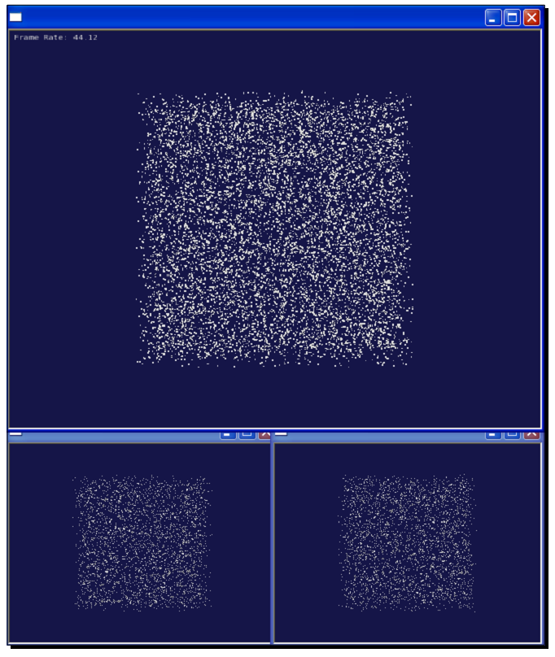

Chapter 12: Improving Rendering Efficiency
============================================

在本书的最后一章，我们将介绍用于构建快速，实时渲染系统所需要的技术，从而以一种高效的方式帮助用户载入，组织与渲染大规模数据集。理解一个较大API调用集合的所有类，方法与全局变量相对较为容易，但是将我们所学的内容应用实际应用，正确且高效的方式，则是另一回事。这里改善渲染效率的方法也许有助于解决我们时不时会遇到的某些引擎问题。

在本章中，我们将会了解：

* 在OSG中实现多线程操作与渲染的基本原则
* 场景裁剪与闭塞裁剪的概念
* 通过修改与共享几何体与纹理改善渲染性的不同方法
* 在处理大数据集时的动态分页机制及其应用

Open Threads basics
----------------------

OpenThreads是一个用于OSG类与应用的一个轻量级，跨平台的API。他支持一个多线程程序所需要的基本元素，也就是，线程对象（OpenThreads::Thread），用于锁住不同线程共享数据的信号量（OpenThreads::Mutex），边界（OpenThreads::Barrier），以及条件（OpenThreads::Condition）。后两者经常用于线程同步。

为某一目的创建新线程，我们需要派生OpenThreads::Thread基类并重新实现其虚方法。还有一些方便处理线程与线程属性的全局函数，例如：

* GetNumberOfProcessors()函数获取可用的处理器数量
* SetProcessorAffinityOfCurrentThread()函数设置处理与当前线程的关系（也就是，哪一个处理器用来执行当前线程）。他应在线程当前运行时调用。
* OpenThreads::Thread的CurrentThread()静态函数返回指向当前运行线程实例的指针。
* OpenThreads::Thread的YieldCurrentThread()静态函数获取当前线程并且让其他线程接管处理器的控制。
* OpenThreads::Thread的microSleep()静态方法使得当前线程睡眠指定的毫秒数。他也可以用在单线程程序中。

Time for action - using a separate data receiver thread
~~~~~~~~~~~~~~~~~~~~~~~~~~~~~~~~~~~~~~~~~~~~~~~~~~~~~~~~~~~~

在该示例中，我们将使用OpenThreads库设计一个新线程，并用来由标准输入读取字符。同时，主进程，也就是，OSG查看器与渲染后端将会接收输入字符并使用osgText库在屏幕上进行显示。只有当数据线程与主进程同时完成时，整个程序才会正常退出。

1. 包含必须的头文件：

::

    #include <osg/Geode>
    #include <osgDB/ReadFile>
    #include <osgText/Text>
    #include <osgViewer/Viewer>
    #include <iostream>

2. 声明一个新的DataReceiverThread类作为OpenThread::Thread类的派生类。在该类中需要实现两个新方法以确保线程可以正常工作：cancel()方法定义了线程的关闭处理，而run()方法定义了由线程的开始到结束所发生的动作。我们同时定义了一个mutex变量用于线程间同步，并有为了方便使用单例模式：

::

    class DataReceiverThread : public OpenThreads::Thread
    {
    public:
        static DataReceiverThread* instance()
        {
            static DataReceiverThread s_thread;
            return &s_thread;
        }    
        virtual int cancel();
        virtual void run();
        
        void addToContent( int ch ); 
        bool getContent( std::string& str );    
    protected:
        OpenThreads::Mutex _mutex;
        std::string _content;
        bool _done;
        bool _dirty;
    };

3. 关闭处理非常简单：设置变量_done（在run()实现中重复检测直到为true）并等待线程完成：

::

    int DataReceiverThread::cancel()
    {
        _done = true;
        while( isRunning() ) YieldCurrentThread();
        return 0;
    }

4. run()方法是线程类的核心。他通常包含一个循环，在其中执行实际的处理动作。在我们的数据接收线程中，我们使用std::cin.get()来由键盘输入读取字符并且确定是否可以添加到成员字符串_content中。当_done被设置为true时，run()方法结束生命周期，而整个线程也同样如此：

::

    void DataReceiverThread::run()
    {
        _done = false;
        _dirty = true;
        do
        {
            YieldCurrentThread();
            
            int ch = 0;
            std::cin.get(ch);
            switch (ch)
            {
            case 0: break;  // We don't want '\0' to be added
            case 9: _done = true; break;  // ASCII code of Tab = 9
            default: addToContent(ch); break;
            }
        } while( !_done );
    }

5. 在这里要小心std::cin.get()函数：他首先由用户输入读取一个或多个字符，直到回车键被按下并接收到'\n'为止。然后，他由缓冲区中一次选取一个字符，并连续将其添加到成员字符串中。当缓冲区中的所有字符都遍历完成后，他会清空缓冲区并再次等待用户输入。

6. 自定义的addToContent()方法向_content添加新字符。该方法当然是在数据接收者线程中被调用的，所以当我们改变_content变量时，我们必须锁定mutex对象，来避免其他线程与主进程污染该变量：

::

    void DataReceiverThread::addToContent( int ch )
    {
        OpenThreads::ScopedLock<OpenThreads::Mutex> lock(_mutex);
        _content += ch;
        _dirty = true;
    }

7. 自定义的getContent()方法被用来获取_content变量并将其添加到输入字符串参数。该方法是前面addToContent()方法的逆操作，只能在后续的OSG回调实现中调用。互斥（mutex）对象的作用域锁定操作将会使得整个处理是线程安全的，就如是addToContent()中的处理一样：

::

    bool getContent( std::string& str )
    {
        OpenThreads::ScopedLock<OpenThreads::Mutex> lock(_mutex);
        if ( _dirty )
        {
            str += _content;
            _dirty = false;
            return true;
        }
        return false;
    }

8. 线程实现完成了。现在让我们回到渲染。这里我们所希望的是一个可以依据由主进程中接收到的字符串而动态改变其内容的文本对象。文本对象的更新回调对于实现该功能是必须的。在自定义的更新回调的虚update()方法中（用于可绘制元素，所以这里不需要osg::NodeCallback），我们简单的接收osgText::Text对象以及接收器线程实例，然后重置所显示的文本：

::

    class UpdateTextCallback : public osg::Drawable::UpdateCallback
    {
    public:
        virtual void update( osg::NodeVisitor* nv,
                             osg::Drawable* drawable )
        {
            osgText::Text* text =   
                static_cast<osgText::Text*>(drawable);
            if ( text )
            {
                std::string str("# ");
                if ( DataReceiverThread::instance()->getContent(str) )
                    text->setText( str );
            }
        }
    };

9. 在主体部分，我们首先创建osgText::Text可绘制元素，并且应我们文本更新回调的实例。这里setAxisAlignment()将文本定义为场景中的公告板，而setDataVariance()确保文本对象在更新与绘制过程中是动态更新的。同时还有一个setInitialBound()方法，该方法接受osg::BoundingBox变量作为参数。他会强制可绘制元素最小边界框的定义，并依此计算初始视图矩阵：

::

    osg::ref_ptr<osgText::Text> text = new osgText::Text;
    text->setFont( "fonts/arial.ttf" );
    text->setAxisAlignment( osgText::TextBase::SCREEN );
    text->setDataVariance( osg::Object::DYNAMIC );
    text->setInitialBound(
        osg::BoundingBox(osg::Vec3(), osg::Vec3(400.0f, 20.0f, 20.0f)) 
    );
    text->setUpdateCallback( new UpdateTextCallback );

10. 将文本对象添加到osg::Geode节点并关闭灯光。在启动查看器之前，我们同时需要确保场景被渲染到固定尺寸的窗口中。这是因为我们同时需要使用控制台窗口用于键盘输入：

::

    osg::ref_ptr<osg::Geode> geode = new osg::Geode;
    geode->addDrawable( text.get() );
    geode->getOrCreateStateSet()->setMode(
        GL_LIGHTING, osg::StateAttribute::OFF );
    osgViewer::Viewer viewer;
    viewer.setSceneData( geode.get() );
    viewer.setUpViewInWindow( 50, 50, 640, 480 );

11. 在查看器运行之前启动数据接收器，并在之后退出：

::

    DataReceiverThread::instance()->startThread();
    viewer.run();
    DataReceiverThread::instance()->cancel();
    return 0;

12. 如果我们使用子系统控制台编译我们的工程，则会出现两个窗口。将焦点放在控制台窗口中并输入一些字符。当我们完成时输入回车，并在回车后按下Tab以退出接收者线程：

13. 我们将会注意到相同的字符出现在OSG渲染窗口中。这可以被看作一个非常基本的文本编辑器，文本源位于一个单独的接收线程中，而绘制界面则是在OSG场景图中实现的：

.. image:: _images/osg_threads_window.png

What just happened?
~~~~~~~~~~~~~~~~~~~~~

介绍线程与多线程编程超出了本书的范围。然而，使用单独的线程来由磁盘或是局域网载入大文件已经非常常见。其他一些程序使用线程来持续接收来自网络服务或客户端计算机的数据，或是用户定义输入设备，包括GPS与雷达信号，这会极大的改善速度与效率。其余的数据处理线程甚至可以指定要其上进行处理的处理器，从而可以利用今天双核心与四核CPU。

OpenThreads库为OSG开发者甚至是普通的C++线程程序员提供了一个最小但完整的面向对象线程接口。他被osgViewer库用来实现多线程场景更新、裁剪与绘制，这是OSG中高效渲染的秘密。在这里要注意，多线程渲染并不简单指在单独的线程中执行OpenGL调用，因为相关的渲染环境（在Win32下为HGLRC）是线程相关的。一个OpenGL环境只能位于一个线程中（使用wglMakeCurrent()函数）。所以，仅封装一个OpenGL环境的OSG渲染窗口在多线程中不会被激活和接受异步OpenGL调用。他要求对线程模型的精确控制来使得一切运行良好。

Pop quiz - carefully blocking threads
~~~~~~~~~~~~~~~~~~~~~~~~~~~~~~~~~~~~~~~

存在一个同时用在DataReceiverThread类示例中的addToContent()与getContent()方法中的互斥对象。他可以阻止不同的线程同时访问相同的数据。我们是否可以指出两个方法同时处理冲突的_content变量的最可能时刻吗？如果这里我们没有使用互斥会发生什么情况呢？

Understanding multithreaded readering
----------------------------------------

实时渲染的传统方法总是涉及到三个单独步骤：用户更新（UPDATE），场景裁剪（CULL）以及执行OpenGL调用（DRAW）。

用户更新包括各种类型的动态数据修改与操作，例如修改场景图层次结构，载入文件，骨骼顶点动画，以及更新相机位置与属性。然后他将场景图发送到裁剪阶段，在该阶段，出于改善最终渲染性的目的，场景会被重新构建。在查看截面不可见或是出于某种原因隐藏的对象将会被移除，而其余部分会由渲染状态进行排序并推送到绘制列表。该列表会在最后的绘制阶段进行遍历，而所有的OpenGL命令将会被执行来进行图像管线的处理。

一个单处理器系统需要串行处理所有三个阶段，从而导致一帧对于用户需求过长的情况。

在一个多处理器与多显示设备的系统中，我们可以有多个并行的裁剪与绘制任务来加快帧速率。特别是当管理多个渲染窗口时，为每个窗口生成一个处理裁剪与绘制阶段的新线程模型是必需的，并且同时执行。当然，这样会比仅使用一个线程要高效得多。

Time for action - switching between different threading models
~~~~~~~~~~~~~~~~~~~~~~~~~~~~~~~~~~~~~~~~~~~~~~~~~~~~~~~~~~~~~~~~~

OSG提供了非常方便的接口用于选择线程模型。不同的线程模型可以用于不同的环境，并有不同的效率。在此示例中，我们将会显示当运行一个具有大量四边形几何体的场景，在osgViewer::CompisteViewer的三个渲染窗口同时运行时，三个常用线程模型之间的区别。

1. 包含必须的头文件：

::

    #include <osg/Group>
    #include <osgDB/ReadFile>
    #include <osgViewer/ViewerEventHandlers>
    #include <osgViewer/CompositeViewer>

2. 四边形可以使用osg::createTexturedQuadGeometry()函数生成。其位置简单的通过一个随机数生成器确定。这样的一个四边形不会占用过多的系统资源。但是大量没有使用对象共享机制的四边形将会很快耗尽系统与视频卡内存（由于每一个几何体显示列表的构建），这对于测试系统负载容量非常有帮助：

::

    #define RAND(min, max) \
            ((min) + (float)rand()/(RAND_MAX+1) * ((max)-(min)))
    osg::Geode* createMassiveQuads( unsigned int number )
    {
        osg::ref_ptr<osg::Geode> geode = new osg::Geode;
        for ( unsigned int i=0; i<number; ++i )
        {
            osg::Vec3 randomCenter;
            randomCenter.x() = RAND(-100.0f, 100.0f);
            randomCenter.y() = RAND(1.0f, 100.0f);
            randomCenter.z() = RAND(-100.0f, 100.0f);
            
            osg::ref_ptr<osg::Drawable> quad =
                osg::createTexturedQuadGeometry(
                    randomCenter,
                    osg::Vec3(1.0f, 0.0f, 0.0f),
                    osg::Vec3(0.0f, 0.0f, 1.0f)
                );
            geode->addDrawable( quad.get() );
        }
        return geode.release();
    }

3. 组合查看器对于每个渲染窗口需要一个单独的osgViewer::View实例。窗口的位置与大小是由setUpViewInWindow()方法确定的：

::

    osgViewer::View* createView( int x, int y, int w, int h,
                                 osg::Node* scene )
    {
        osg::ref_ptr<osgViewer::View> view = new osgViewer::View;
        view->setSceneData( scene );
        view->setUpViewInWindow( x, y, w, h );
        return view.release();
    }

4. 在主体部分，我们首先使用一个参数解析器来选择线程模型。默认情况下，OSG会依据处理器与程序的渲染窗口的数量自动选择最佳的线程策略，也就是AutomaticSelection。但是我们仍然由内建值中指定一种处理多线程渲染的方法，包括SingleThreaded，ThreadPerContext与ThreadPerCamera：

::

    osg::ArgumentParser arguments( &argc, argv );
    osgViewer::ViewerBase::ThreadingModel th =
        osgViewer::ViewerBase::AutomaticSelection;
    if ( arguments.read("--single") ) th =
        osgViewer::ViewerBase::SingleThreaded;
    else if ( arguments.read("--useContext") ) th =
        osgViewer::ViewerBase::ThreadPerContext;
    else if ( arguments.read("--useCamera") ) th =
        osgViewer::ViewerBase::ThreadPerCamera;

5. 创建三个渲染视图并将大量的四边形几何体应用到其中的每一个。在该示例中总计分配了20000个四边形用于演示不同的线程模型：

::

    osgViewer::View* view1 = createView( 50, 50, 640, 480, 
        createMassiveQuads(10000) );
    osgViewer::View* view2 = createView( 50, 550, 320, 240, 
        createMassiveQuads(5000) );
    osgViewer::View* view3 = createView( 370, 550, 320, 240, 
        createMassiveQuads(5000) );
    view1->addEventHandler( new osgViewer::StatsHandler );

6. 创建组合查看器并设置用户指定的线程模型。注意，这里的setThreadingModel()方法不仅能用于osgViewer::CompositeViewer，而且对于大多数普通的osgViewer::Viewer实例也是可用的：

::

    osgViewer::CompositeViewer viewer;
    viewer.setThreadingModel( th );
    viewer.addView( view1 );
    viewer.addView( view2 );
    viewer.addView( view3 );
    return viewer.run();

7. 编译程序（假定其名字为MyProject.exe）并在控制台模式下输入下面命令：

::

    # MyProject.exe --single

8. 最终的结果如下图所示。注意对于单线程模型帧速率仅为20，其中，更新、裁剪与绘制阶段是在相同的线程中依次完成的：

.. image:: _images/osg_multithread_single.png

9. 将参数由--single改变--useContext并再次启动测试程序。这次我们将会发现帧速率增加了。这是因为OSG除了用户更新阶段，对于裁剪与绘制阶段使用单独的线程，从而大大的改进了渲染性能：

10. 将命令行参数修改为--useCamera并再次启动测试程序。这际上是对于现令大多数多处理器计算机的默认策略。他甚至好于第二种线程模型，因为他对于相机与渲染窗口使用不同的线程，并在单独的CPU上运行线程以获得最大的效率：

.. image:: _images/osg_multithread_camera.png

What just happened?
~~~~~~~~~~~~~~~~~~~~~

SingleThreaded线程模型可以表示为下图。每个渲染窗口中的CULL与DRAW阶段也许会有不同的聚合时间，在这里一帧被定义为由每一个视图的CULL开始直到最后一个视图的DRAW为止的总时间。在这里忽略了用户更新操作，因为在所有的线程模型中他们总是占用相同的聚合时间：

.. image:: _images/osg_threads_frame.png

更新、裁剪与绘制操作总是在一个线程内执行。如果有多个子视图，也就是，多个裁剪与绘制任务要完成，那么他们就会被依次执行。这是OSG中渲染场景最高效的模型，但是对于测试新功能依然有用。同时他也简化了与GUI的集成，例如MFC与Qt。因为我们并不关心线程冲突，所以我们可以仅将osgViewer::Viewer或osgViewer::CompositeViewer的run()方法放在GUI计时器事件回调中，而不需要使用额外的线程，正如我们在第9章所做的那样。

ThreadPerContext模型可以直接由下图进行表示：

.. image:: _images/osg_threads_context.png

每个组合查看器的子视图有其自己的线程，在其中执行裁剪与绘制任务。由于线程的并行特性，每一个帧的执行时间将会短于最长CULL与DRAW对的总时间。在所有的DRAW任务完成之后，下一帧的用户更新将会立即启动。

这在渲染性能方面要好于单线程模型。他甚至可以利用多处理器，因为每个线程可以占用单独的处理器，以最大化硬件资源的使用。

然而，更好的解决方案是ThreadPerCamera模型。这会将每个视图的CULL阶段与DRAW阶段分开，同时在线程中实现。这意味着对于每个渲染窗口我们至少有一个CULL线程与一个DRAW线程，因而可以完全利用多处理器系统。因为裁剪操作一定与osg::Camera节点相关（他为视图截图裁剪管理视图与投影矩阵），我们将该线程模型称为“每个相机一个线程”模型，如下图所示：

.. image:: _images/osg_threads_camera.png

在线程模型中，DRAW阶段被看作两个并行处理，在CPU端分民命令，而在GPU端执行渲染缓冲区交换并执行。交换缓冲区操作的时间消耗可以是统一的，并且在所有的DRAW分发操作完成之后执行。但是在这之前，线程模型会预告启动下一帧的用户UPDATE阶段。这种处理再一次极大的改善了渲染性能，但是如果用户更新改变正在被分发的场景数据，也许会导致未预期的结果。这也正是我们为也许会被修改的场景对象设置动态标记的原因：

::

    node->setDataVariance( osg::Object::DYNAMIC );

默认情况，如果检测到多处理器系统，OSG将会支持ThreadPerCamera线程模型。

Dynamic scene culling
-----------------------

裁剪技术可以进行简单的描述：不绘制我们看不见的东西。我们可以使用两种主要方法实现该目的：通过减少不需要进行细化的多边形面，以及忽略当前视口中不可见的对象。

前者通常是由LOD（level-of-detail）算法实现的，在OSG中是通过osg::LOD类实现的。后者实际上是场景裁剪的定义，目的是查找场景图中根本不需要渲染的对象。在OSG中有多种裁剪技术类型：

* 背面裁剪（Back face culling）：这是由osg::CullFace类实现的，该类封装了OpenGL的glCullFace()函数。他会由渲染管线的相机中移除所有多边形面，从而减少内存占用。这种技术很有用，特别是对于复杂的对象，但是对于透明的物体或是有洞的物体也许会有错误。
* 小特性裁剪（Smallfeature culling）：该技术会基于可见性测试允许过小而看不见的对象的移除，结果导致如果绘制对象则会影响对象的像素数。如果该数目小于用户定义的最小像素阈值，则该对象会由渲染列表中移除。
* 视图截面裁剪（View-frustum culling）：其思想只是简单的不渲染超出由渲染窗口的视图与投影矩阵所定义的视图截面的部分。这是现代渲染程序中最高效的方法。
* 闭合裁剪（Occlusion culling）：该技术会确定由于隐藏在其他对象之后，哪些对象会完全不可见。我们很快会在下一节进行讨论。

注意，小特性裁剪方法也许会导致实际的实际的几何体点不可渲染。要禁止该特性，我们可以使用相机节点的setCullingMode()方法：

::

    camera->setCullingMode(
       camera->getCullingMode() & ~osg::Camera::SMALL_FEATURE_CULLING );

Occluders and occludees
-------------------------

当渲染复杂的场景时，由查看者的视角来看，两个或多个对象彼此重叠是很常见的现象。这会导致重复绘制，这意味着当最终的图片仅显示最后一个对象时，相同位置的像素会被多次写入帧缓冲区。这会导致效率损失，因为多次绘制并没有必要（所谓的覆盖绘制）。

闭合裁剪技术简单的通过不绘制为距离相机更近的对象所隐藏的几何体来提高渲染性能。覆盖其他可绘制元素的对象被称之为遮光板，而场景的其余部分可以被看作非遮光区域（未没有必要使用这样不熟悉的单词）。

Improving your application
------------------------------

Paging huge scene data
--------------------------

Making use of the quad-tree
-----------------------------

Summary
---------
